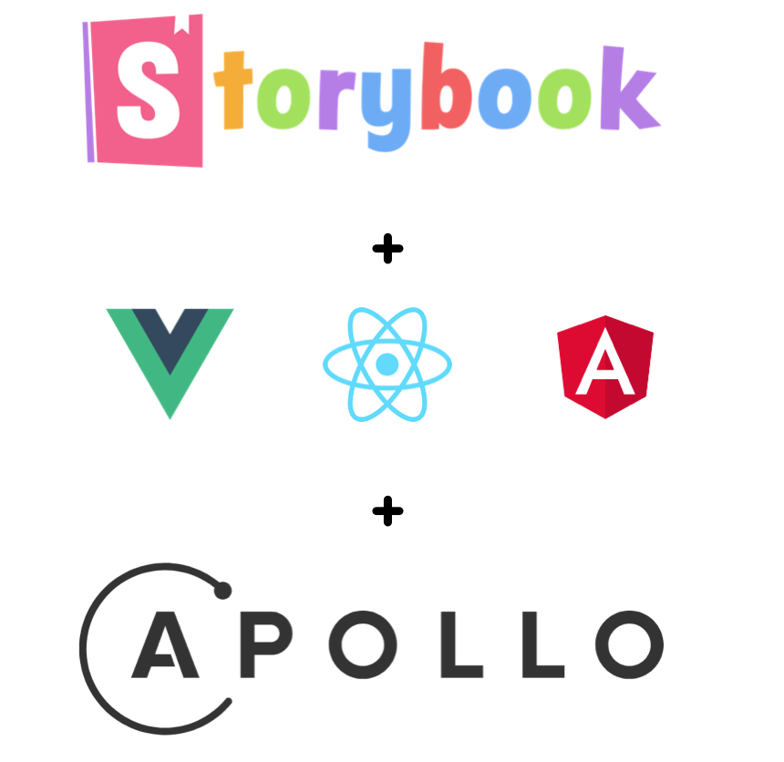
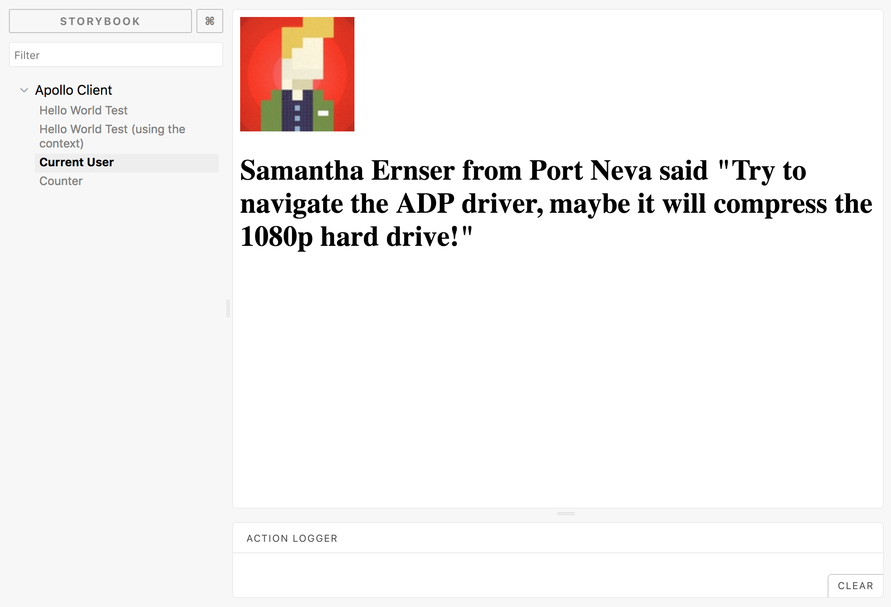

# Apollo Storybook Decorator

<p align="center">
  
</p>

<p align="center">
  Wrap your React Storybook stories with Apollo Client.
</p>

## Supports

### React (Apollo Client V2)

<p>
  <a href="https://www.npmjs.com/package/apollo-storybook-react">
    
  </a>
</p>

### React (Apollo Client V1)

<p>
  <a href="https://www.npmjs.com/package/apollo-storybook-decorator">
    
  </a>
</p>

### React Native (Apollo Client V2)

<p>
  <a href="https://www.npmjs.com/package/apollo-storybook-react-native">
    
  </a>
</p>

## Coming Soon:

- Vue
- Angular

### The Gist

- Provide GraphQL type definitions to the decorator.
- Provide a Mock object like you would with `graphql-tools` http://dev.apollodata.com/tools/graphql-tools/mocking.html
- Optionally pass other redux reducers to take advantage of Redux UI state with Apollo Client

Take this:

<p align="center">
  
</p>

To Render this:
<p align="center">
  
</p>

### Getting Started

For Apollo Client 2.x (React)

```sh
yarn add apollo-storybook-react -D

npm install apollo-storybook-react --save-dev
```

### Full Example

<p align="center">
  
</p>

### Usage

You can add the decorator at a per story basis:

```js
storiesOf('Apollo Client', module).addDecorator(
  apolloStorybookDecorator({
    typeDefs,
    mocks,
  })
);
```

or you can add it to all stories, head to your storybook `config.js`

```js
import { configure, addDecorator } from '@storybook/react';
import apolloStorybookDecorator from 'apollo-storybook-decorator-react';
import typeDefs from '../wherever/your/typeDefs/live';
import mocks from '../wherever/your/mocks/live';

addDecorator(
  apolloStorybookDecorator({
    typeDefs,
    mocks,
  })
);

function loadStories() {
  // stories...
}

configure(loadStories, module);
```

#### Options

```js
type DecoratorType = {
  //string representing your graphql schema, if you use tools like `babel-plugin-inline-import` you can import this from a  .graphql file
  typeDefs: string | Array<string>,
  // object that resolves the keys of your graphql schema
  mocks: Object,
  apolloClientOptions?: Object,
  apolloLinkOptions?: Object,
  // optional typeResolvers for complex mocking
  typeResolvers?: Object,
  // optional context
  context?: Object,
  // optional root value
  rootValue?: Object,
};
```

### Apollo Client 1.x

#### Getting Started

```sh
yarn add apollo-storybook-decorator -D

npm install apollo-storybook-decorator --save-dev
```

#### Options

Apollo Client 1.x:

The Decorator:

```js
type DecoratorType = {
  //string representing your graphql schema, if you use tools like `babel-plugin-inline-import` you can import this from a  .graphql file
  typeDefs: string | Array<string>,
  // object that resolves the keys of your graphql schema
  mocks: Object,
  // optional reducers to add other redux libraries or your own reducers
  reducers?: Object,
  // optional redux middlewares to be applied during creation of the redux store
  reduxMiddlewares?: Array<Function> | ({ apolloClient }: MiddlewaresType) => Array<Function>,
  // optional apollo client constructor options
  apolloClientOptions?: Object,
  // optional typeResolvers for complex mocking
  typeResolvers?: Object,
  // optional context
  context?: Object,
  // optional root value
  rootValue?: Object,
}
```

### Development

This repo is split up using the `lerna` monorepo module.

To get started, clone this repo and run the following command:

```bash
$ yarn # install node deps
```

```bash
$ lerna boostrap
```

To run the project's examples, run:

Current storybook is enabled in `apollo-storybook-react` and `apollo-storybook-v1`

```bash
cd packages/$PACKAGE_OF_CHOICE
```

```bash
$ yarn storybook # for storybook testing
```
